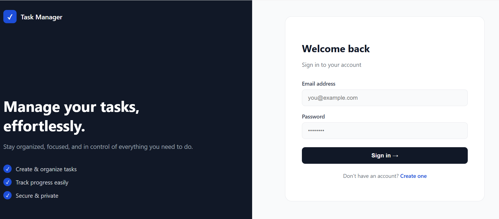

 Run the backend:

```bash
npm run dev
```

### Frontend Setup

```bash
cd frontend
npm install
npm start
```

## API Endpoints

### Auth Routes
| Method | Endpoint | Description |
|--------|----------|-------------|
| POST | /api/auth/register | Register new user |
| POST | /api/auth/login | Login user |

### Task Routes (Protected)
| Method | Endpoint | Description |
|--------|----------|-------------|
| GET | /api/tasks | Get all tasks |
| POST | /api/tasks | Create new task |
| PUT | /api/tasks/:id | Update task |
| DELETE | /api/tasks/:id | Delete task |

## Screenshots

### Login Page


### Dashboard


## Developer

**Bhakti Maheshwari**  
B.Tech CSE | Jabalpur Engineering College  
GitHub: [@bhaktimaheshwari31](https://github.com/bhaktimaheshwari31)
